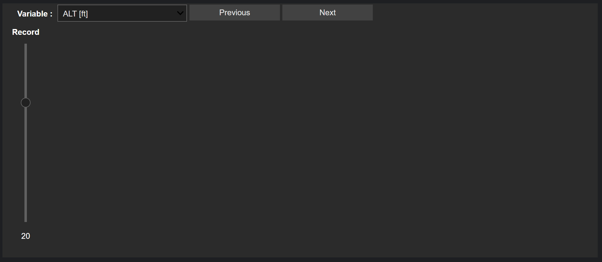

# Application de l'analyse de données, des statistiques descriptives et de l'apprentissage automatique dans l'industrie aéronautique

This repository is my final work on the MVA course supervised by Jérôme Lacaille.

## Objective

The objective of this work is to analyse 1000 flights. The analysis is contained in the file `main.ipynb` and is divided in 4 parts:
* loading and exploring the data
* extract the phases and especially the climbs
* cluster the climbs
* link with fuel consumption

## Installation

To visualize and run the main notebook, you need to

```{bash}
git clone git@github.com:MatiasEtcheve/AERO.git
cd AERO
pip install -r requirements.txt
```

You also need to put the file `Aircraft_01.h5` in the folder `archive/`.

Then you can simply run the notebook `main.ipynb`.

## Encountered problems 

I have had a lot of problems when working on this project. 
The main problem was dealing with Plotly widgets. 
While Plotly offers a nice interactive views, the widgets don't work well / or at all when using 
Windows Subsytem for Linux WSL2.

This bug is not fixed, and I will open an issue on ipywidget. 
Currently, it looks like the version `ipywidgets==7.7.2` works the best. Below is the bug I obtained in most cases.



## Usefulness of the files

This repository is quite simple:

| File/folder  | Usefulness                                                                                                                                                           |
|--------------|----------------------------------------------------------------------------------------------------------------------------------------------------------------------|
| `archive/`   | Folder containing the dataset. The main notebook also write to this folder to save the climbs.                                                                       |
| `tabata`     | Tabata toolbox from `https://github.com/jee51/tabata`. Modified to add 2 features:<br>* creating a dataset from a generator<br>* seeing a phase with multiple values |
| `checks.py`  | Contains all the basic checks to perform on a dataset                                                                                                                |
| `main.ipynb` | Main work                                                                                                                                                            |
| `utils.py`   | Contains functions to extract sequence in DataFrames                                                                                                                 |
